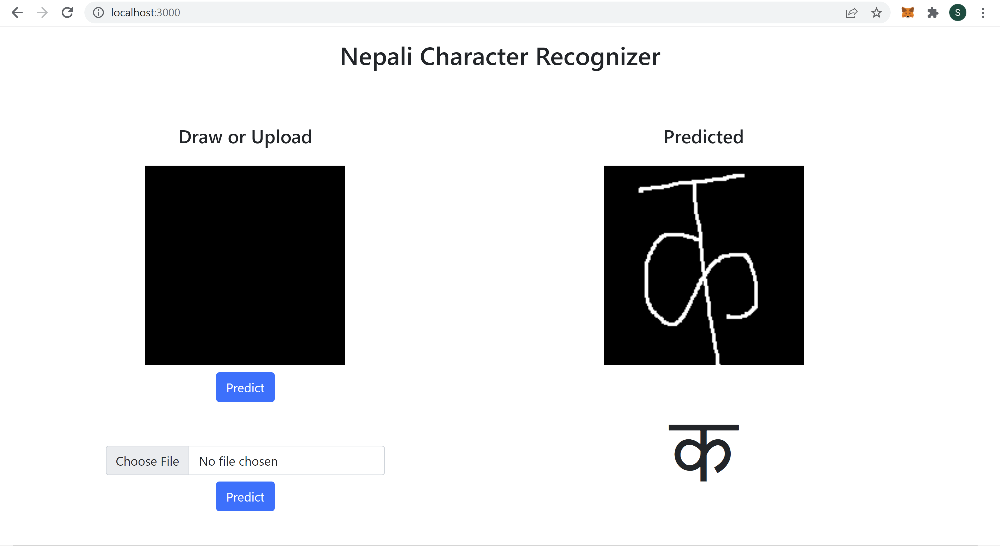
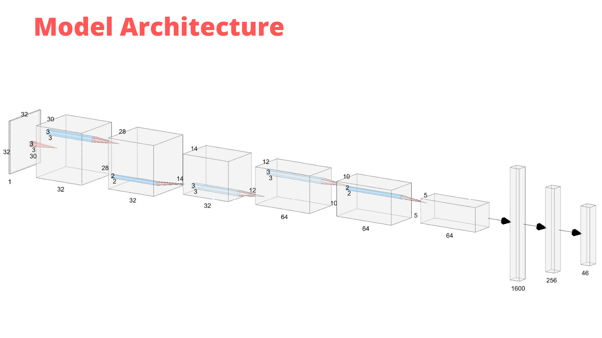
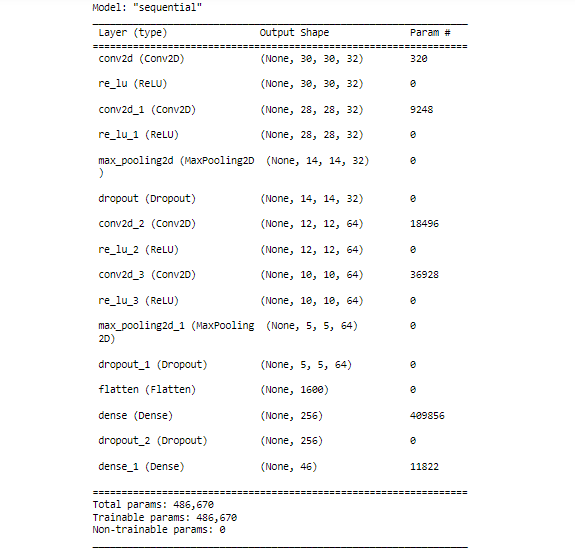

# Nepali Handwritten Character Recognization

Dataset: 
https://archive.ics.uci.edu/ml/machine-learning-databases/00389/

A Convolution Neural Network based approach for the classification of nepali characters. Alphabets from क-ज्ञ and digits from ०-९ can be recognized by the network with about 98.6% accuracy.

We used the following network architecture:

Summary of the model

## Libraries used
- tensorflow
- numpy
- keras
- matplotlib
- opencv-python
- Flask
- Pillow

## Steps to run the project

1. Clone the project
2. Install the required libraries using `pip install -r requirements.txt`  
(Mannually install above libraries in case of any error)
3. Go to webiste folder and run `python app.py` from the command line or terminal.
4. Go to address `localhost:3000` from your favourite browser

You can also modify the model by editing `Nepali Handwritten.ipnyb` file using jupyter notebook.  